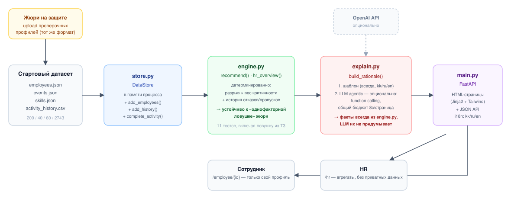
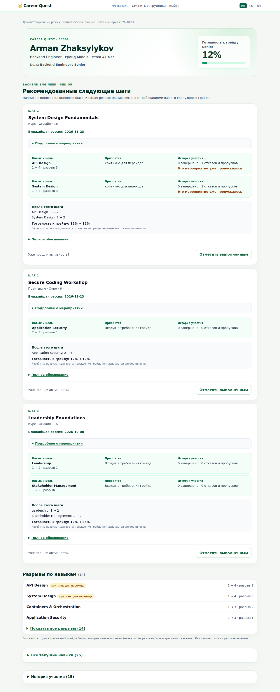
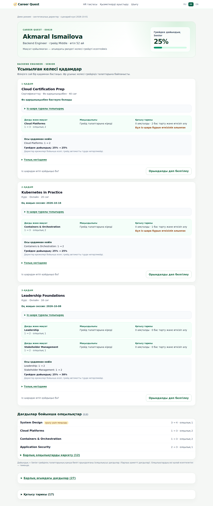
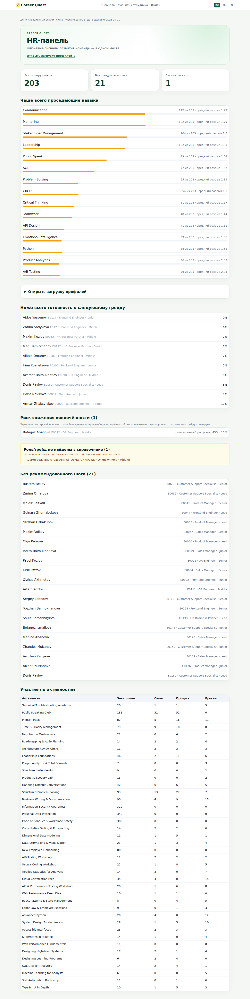
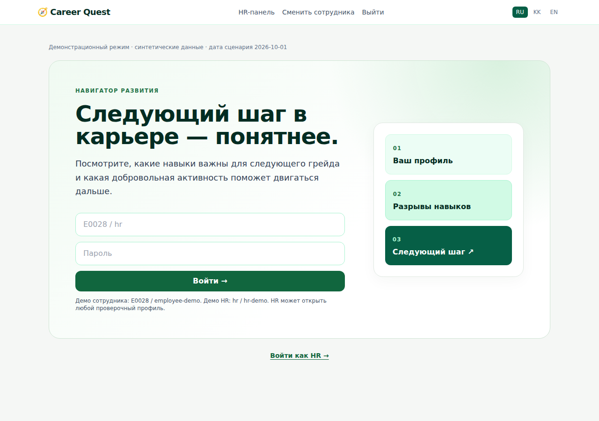

# Career Quest — AI-навигатор развития сотрудника


HackAlem AI, трек **Halyk Bank**, кейс 1 «Career Quest». Платформа геймификации
жизненного цикла сотрудника — но её ядро, как и требует ТЗ, не геймификация, а
**качество и объяснимость AI-рекомендации** следующего шага развития.

**Содержание:** [Краткое описание](#краткое-описание) ·
[Демо за 3 минуты](docs/DEMO.md) ·
[Сверка с ТЗ](docs/REVIEW.md) ·
[Что реализовано](#что-реализовано) ·
[Как работает решение](#как-работает-решение-основной-сценарий) ·
[Как это решает задачу жюри](#как-это-решает-задачу-жюри-проверочные-профили) ·
[Аналоги](#аналоги) ·
[Потенциал и оригинальность](#потенциал-развития-и-оригинальность-подхода) ·
[Технологии](#технологии) ·
[Архитектура](#архитектура) ·
[Установка и запуск](#установка-и-запуск) ·
[Как проверить решение](#как-проверить-решение) ·
[Данные и интеграции](#данные-и-интеграции) ·
[Ограничения](#ограничения) ·
[Скриншоты](#скриншоты) ·
[Deployed-версия](#deployed-версия)

## Краткое описание

Сотрудник видит поток разрозненных HR-событий без связи со своим ростом и проходит
обучение формально, в день дедлайна. Career Quest на основе профиля, разрывов по
навыкам относительно следующего грейда и истории участия сотрудника подбирает
1–3 релевантные добровольные активности и объясняет рекомендацию минимум тремя
факторами. HR получает срез: какие навыки чаще проседают, у кого нет
рекомендованного шага, как проходит участие по активностям.

## Что реализовано

- Профиль сотрудника с траекторией: роль, грейд, навыки, пройденные активности,
  разрывы относительно требований следующего грейда (или явной цели `career_goal`).
- На странице сотрудника сначала видны рекомендованные шаги и три фактора каждого
  обоснования; полный список разрывов и история раскрываются по запросу. HR-панель
  начинает со сводных показателей. Интерфейс адаптирован для узких экранов.
- Карточка шага показывает ближайшую сессию или формат в своём темпе; «Подробнее»
  раскрывает описание и доступные даты. Отметка выполнения — отдельное действие.
- До выполнения виден рассчитанный результат: прирост навыков и готовность после
  конкретного шага. Курсы с нулевым приростом нужного навыка не рекомендуются.
- Завершения после `last_review_date` учитываются поверх последней оценки навыков;
  история обрабатывается по датам, повторная загрузка не увеличивает уровни повторно.
  Дата сценария — `2026-10-01`, как предписывает README исходного датасета.
- AI-рекомендация 1–3 следующих шагов с объяснением, опирающимся на **грейд/разрыв,
  критичность навыка для перехода и историю участия** (три фактора и больше — прямое
  требование ТЗ).
- Устойчивость к «проблеме одного фактора» (см. «Как это решает задачу жюри» ниже) —
  специально проверено на примере из ТЗ.
- Отметка активности выполненной → пересчёт уровня навыка по правилу датасета
  (`gain`, не выше `max_level`, и **не ниже уже достигнутого** — см. регрессионный тест
  `test_skill_never_decreases_even_if_event_max_level_is_lower`) → обновление
  траектории. После отметки — явный баннер «что изменилось» (Explainability: не
  просто новые цифры, а конкретное было→стало по каждому затронутому навыку).
- HR-панель: проседающие навыки, сотрудники без рекомендованного шага, участие по
  активностям.
- Загрузка дополнительных профилей/истории в формате датасета — то, что жюри делает
  на защите с проверочными профилями.
- JSON API поверх той же логики — для программной проверки, без интерфейса.
- **Готовность к следующему грейду** — простая проверяемая метрика (доля требований
  грейда, уже выполненных), прогресс-бар на странице сотрудника, список отстающих на
  HR-панели.
- **Локализация интерфейса kk/ru/en**, данными: язык страницы сотрудника берётся из его
  `preferred_language` (опциональный пункт ТЗ, реализован не «для галочки»).
- **Риск снижения вовлечённости** (`engine.py::engagement_risk`, опциональный пункт ТЗ
  «прогноз риска оттока») — реально реализованная эвристика на HR-панели, не просто
  строчка в разделе «потенциал развития». Честная оговорка о её пределах — в
  «Ограничениях».
- Вход с паролем и подписанной сессией. Сотрудник читает и изменяет только свой
  профиль; HR видит сводку, открывает профили и загружает данные. Те же проверки
  действуют в JSON API. Изменяющие запросы защищены CSRF-токеном.
  Учебные пароли опубликованы для жюри; перед пилотом демодоступ нужно отключить.
- Автотесты (`backend/tests/`) — в том числе формальная проверка ровно
  того примера-ловушки, который описан в ТЗ, и бюджета времени AI-рекомендации.
- Обработка некорректного ввода: несуществующий ID сотрудника, битый JSON/CSV при
  загрузке проверочных профилей — понятное сообщение вместо падения приложения.
  Профили и история проверяются до применения; ошибка в одном файле не оставляет
  частично загруженных данных.
- **ИИ не блокирует страницу**: профиль, факторы и прогноз доступны сразу.
  Объяснение запрашивается отдельной кнопкой; весь асинхронный цикл ограничен 8 с,
  автоматические повторы SDK отключены. Таймаут отменяет запрос и оставляет базовое
  объяснение. Успешные ответы кэшируются на 5 минут по фактам и языку; изменение
  профиля меняет ключ кэша. Лимит процесса — 12 новых запросов в минуту и 4 одновременно.
- **Добровольность** (ТЗ: «принуждение — главный предиктор провала»): рекомендации
  никогда не включают `mandatory`-события (проверено тестом), а отметка выполненной
  активности — всегда явное действие сотрудника (нажатие кнопки), ничего не
  назначается автоматически.
- **Честная обработка нестандартных проверочных профилей**: если роль/грейд
  сотрудника не входят в справочник `role_profiles` (опечатка или сознательно
  нестандартный тестовый профиль жюри), система явно говорит «недостаточно данных»,
  а не молча показывает ложные «100% готов» — раньше эти два случая были неразличимы
  (регрессионные тесты: `test_unknown_role_gives_none_readiness_not_false_100_percent`,
  `test_hr_overview_buckets_unknown_role_separately_and_does_not_crash`). Такие профили
  видны отдельным списком на HR-панели.
- **Обоснование всегда явно называет все три фактора**, а не только когда они «интересные»:
  раньше некритичный навык просто не упоминался как таковой (пропускалось молчанием),
  теперь явно — «не критичен, но входит в требования грейда».

Геймификация (внутренняя валюта, каталог наград и т.п.) — по ТЗ опциональна и не
входит в обязательную часть; в этой версии не реализована в пользу качества ядра.

## Как работает решение (основной сценарий)

1. Открыть `/` → войти как сотрудник `E0028 / employee-demo` или HR `hr / hr-demo`.
2. На `/employee/{employee_id}` видно: профиль, грейд, разрывы по навыкам до
   следующего грейда, до 3 доступных шагов с обоснованием и прогнозом, историю участия.
   Если настроен ключ — в раскрытом объяснении доступна кнопка ИИ и список реально
   вызванных инструментов. Без ключа весь основной сценарий сохраняется.
3. Нажать «Отметить выполненным» на одном из шагов → уровень навыка поднимается по
   правилу датасета, страница обновляется, часть разрывов закрывается.
4. `/hr` → агрегированный срез по всем 200 сотрудникам.

## Как это решает задачу жюри (проверочные профили)

ТЗ прямо описывает ловушку: «у сотрудника ниже всего Public Speaking, но он трижды
пропускал такие активности, а для перехода критичен System Design — рекомендация
"бери минимальный навык" здесь промахивается». Наш движок (`backend/app/engine.py`)
проходит этот сценарий: разрыв по навыку взвешивается на
критичность навыка для перехода (`role_profiles.critical_skills`, вес ×2), а история
участия (`declined`/`no_show`/`dropped`) используется как отдельный видимый фактор
объяснения и как сигнал при выборе конкретной активности (если сотрудник уже отказывался
именно от этого мероприятия — это явно помечается). Просто «минимальный навык» никогда
не является единственным критерием ранжирования.

При защите: `/hr` → «Загрузить проверочные профили» (или `POST /api/data/upload`)
добавляет профили жюри в тот же процесс без перезапуска, после чего можно открыть
любой из них по `/employee/{employee_id}`.

Это не только утверждение — `backend/tests/test_engine.py::test_trap_profile_from_spec`
формально воспроизводит именно эту ситуацию (критичный System Design с разрывом 2 против
некритичного Public Speaking с тремя отказами по истории) и проверяет, что первым в
рекомендациях идёт System Design.

Для ручной проверки готовы три дополнительных профиля и история в `docs/demo/`.
Пошаговый сценарий и ожидаемые значения — в [руководстве для демо](docs/DEMO.md).
Профиль E0028 из исходных данных имеет собственную историю после последней оценки;
его рекомендации рассчитываются с учётом этой истории и не фиксированы в коде.

## Аналоги

Career Quest относится к той же категории HR-решений, что и
[Fuel50](https://fuel50.com/solutions/reskilling-and-upskilling),
[Gloat](https://gloat.com/platform/the-talent-marketplace/) и
[Eightfold AI](https://eightfold.ai/products/talent-management/): они связывают навыки
с карьерными возможностями, обучением или проектами. Наш прототип сосредоточен на
проверяемом сценарии из кейса: 1–3 добровольных шага с явными факторами рекомендации,
загрузкой проверочных профилей и расчётом без обязательного внешнего API-ключа.

## Потенциал развития и оригинальность подхода

- **Подход не привязан к конкретному кейсу банка**: `DataStore`/`engine.py` работают с
  любым набором `role_profiles`/`employees`/`events` в этой схеме — то же ядро подойдёт
  любой компании с грейдами и матрицей навыков, не только Halyk Bank.
- **Взвешенная многофакторная оценка вместо LLM-«магии» для самого решения**: рекомендация
  считается детерминированно и объяснимо (ТЗ, «Explainability»), LLM отвечает только за
  формулировку — это осознанный архитектурный выбор, а не экономия времени: он даёт
  предсказуемое, тестируемое поведение на любых новых профилях жюри, а не только на
  обучающих примерах.
- **Развитие**: перенос `DataStore` на Postgres без изменения интерфейса модуля;
  реальная аутентификация; менторские механики — на основе `SK_MENTORING`, уже
  входящего в датасет.

## Технологии

- **Backend**: Python 3.13, FastAPI, Jinja2 (сервер-рендеринг HTML — без отдельной
  сборки фронтенда, ради «запуск одной командой» и явного указания ТЗ, что ядро — не
  интерфейс).
- **Стилизация**: готовый CSS Tailwind 3.4.17 включён в репозиторий. Для запуска не
  нужны Node.js и доступ к CDN. Пересборка после изменения классов:
  `cd backend && npx --yes --package tailwindcss@3.4.17 tailwindcss --input styles/tailwind.css --output app/static/tailwind.css --content './app/templates/*.html' --minify`.
- **AI/agentic AI**: OpenAI API (`gpt-4o-mini` по умолчанию) — **опционально**.
  Формулировка объяснения устроена как настоящий agentic-цикл с function calling
  (`explain.py::_llm_agentic_rationale`): модель вызывает инструменты
  `get_skill_history` (история участия по навыку) и `get_alternative_events`
  (альтернативные мероприятия). Вызов истории для каждого навыка обязателен; текст
  без этих вызовов заменяется базовым объяснением. Схемы инструментов строгие,
  сотрудник видит список выполненных проверок. Имя сотрудника модели не передаётся.
  Рекомендации, факторы и прогноз всегда считаются в `engine.py`; модель формулирует
  текст, не имеет доступа к изменению профиля. Свободный текст может содержать ошибки,
  поэтому проверенные факторы остаются на карточке независимо от ответа модели.
- **Хранение**: в памяти процесса (см. «Ограничения»).
- **Качество кода**: `pytest` (включая ловушку из ТЗ и бюджет времени
  AI-рекомендации), `ruff` (стиль + типичные баги — забытая привязка переменной в
  замыкании, проглоченный контекст исключения). Workflow для GitHub Actions —
  `.github/workflows/ci.yml` (линт + тесты + `docker compose build && up` с
  проверкой `/health`) — настроен и проверен эквивалентно локально; сами Actions
  на раннерах организации хакатона не выделяются (похоже на лимит биллинга на
  уровне `BAITC-Hacks`, не связано с кодом репозитория).

## Архитектура



```
backend/app/
  store.py     — загрузка датасета (employees/events/skills/history) + добавление
                 профилей жюри + отметка выполненной активности
  engine.py    — детерминированный движок: разрывы по навыкам → вес критичности →
                 история участия при выборе активности под разрыв
  explain.py   — факты → текст: шаблон (всегда) + LLM-обогащение (если есть ключ)
  auth.py      — вход, проверка владельца профиля/HR-роли и CSRF
  main.py      — FastAPI: HTML-страницы + JSON API
  templates/   — index.html (вход), employee.html, hr.html
  static/      — готовый CSS и запрос ИИ-объяснения из браузера
  data/seed/   — стартовый датасет ТЗ (employees.json, events.json, skills.json,
                 activity_history.csv)
```

Поток данных: `store` (сырые данные) → `engine.recommend()` (факты: разрывы,
критичность, история, кандидаты-активности) → `explain.build_rationale()` (текст) →
`main.py` (рендер в HTML/JSON).

## Установка и запуск

Единственная команда:

```bash
docker compose up --build
```

Открыть http://localhost:8000

Учётные записи демо: **E0028 / employee-demo** (только свой профиль) и
**hr / hr-demo** (HR и проверочные профили). В режиме HR можно открыть любого
сотрудника напрямую. Вне демо (`DEMO_MODE=false`) учебные пароли не работают:
задайте `HR_PASSWORD` и `EMPLOYEE_PASSWORDS_JSON` — JSON-словарь ID → пароль
в локальном окружении. `SESSION_SECRET` фиксирует секрет подписи между перезапусками;
без него генерируется случайный секрет на запуск. Для HTTPS задайте `SECURE_COOKIES=true`.

Без Docker:

```bash
cd backend
python -m venv .venv && source .venv/bin/activate
pip install -r requirements.txt
uvicorn app.main:app --reload
```

`OPENAI_API_KEY` не обязателен — см. «Ограничения». Если он нужен, скопировать
`.env.example` → `.env` и указать ключ; `docker compose` подхватит `.env`
автоматически.

## Как проверить решение

1. Войти на http://localhost:8000 и открыть `/employee/E0028` (пример из самого ТЗ) — видны роль
   `Backend Engineer`, грейд `Middle`, навыки, разрывы до `Senior`, готовность в % и
   рекомендованные шаги.
2. В той же браузерной сессии открыть `/api/employees/E0028` — тот же результат в
   JSON с факторами (`gap`, `critical`, `history`). Для curl нужен вход и cookie:
   [пример работы с API](docs/API.md).
3. Отметить любой рекомендованный шаг выполненным (кнопка на странице или
   `POST /api/employees/E0028/complete/{event_id}`) — уровень навыка поднимается,
   разрыв уменьшается; готовность растёт, если закрыто требование грейда. Появляется баннер
   «что изменилось» с точным было→стало по навыку.
4. Открыть http://localhost:8000/hr — проседающие навыки, у кого ниже всего готовность,
   у кого нет рекомендованного шага, участие по активностям.
5. Проверочные профили жюри: форма на `/hr` («Загрузить проверочные профили») или
   `POST /api/data/upload` (multipart, поля `employees_file` — JSON в формате
   `employees.json`, `history_file` — CSV в формате `activity_history.csv`) → затем
   открыть загруженного сотрудника по `/employee/{id}`.
6. Автотесты движка: `cd backend && pip install -r requirements.txt && pytest tests/ -v`
   — включая формальное воспроизведение примера-ловушки из ТЗ (раздел ниже)
   и честную обработку профиля с ролью/грейдом вне справочника.
7. Полный сценарий жюри автоматически проверяет `tests/test_demo.py`: загрузку трёх
   новых профилей, повторную загрузку, приоритет критичного навыка, фактическое
   выполнение с проверкой прогноза и отказ от частичного импорта повреждённых файлов.

Если `last_review_date` отсутствует в загружаемом профиле, его навыки считаются
текущими: старые завершения не добавляют прирост повторно. Для пересчёта обучения
после оценки укажите дату. Одинаковые записи `(employee_id, event_id, date, status)`
при повторном импорте игнорируются. Файлы ограничены 5 МБ каждый; поддержан UTF-8 с BOM.

## Данные и интеграции

- Стартовый датасет ТЗ (`employees.json`, `events.json`, `skills.json`,
  `activity_history.csv`) — 200 профилей, 40 событий, 60 навыков, 24 месяца истории.
  Включён в репозиторий в `backend/app/data/seed/`, так как задача явно требует, чтобы
  решение запускалось и проверялось с этими данными; данные синтетические.
- OpenAI API — опционально, только для текста объяснения (см. «Технологии»).

## Ограничения

- **Хранение в памяти процесса**, не в БД: осознанное упрощение под 5 часов и
  требование «запуск одной командой». Отметки о выполнении и загруженные жюри профили
  не переживают перезапуск контейнера. Для продакшена — заменить `store.py` на
  Postgres/любую БД, интерфейс модуля к этому готов (один класс `DataStore`).
- **Демонстрационные пароли публичны**: сессии, проверки владельца профиля,
  HR-роли и CSRF реализованы, но учебные учётные записи специально доступны жюри.
  Перед использованием реальных данных отключите `DEMO_MODE`, замените пароли,
  настройте HTTPS и корпоративную аутентификацию. В прототипе нет SSO, MFA,
  управления жизненным циклом пользователей и аудита доступа.
- **«Ниже всего готовность» на HR-панели — это не публичный рейтинг результативности**
  (тот, что явно запрещён ТЗ): он показывает разрывы в развитии для поддержки.
  Страница защищена серверной проверкой HR-роли и недоступна сотруднику.
- **LLM-объяснение — обогащение, а не необходимость**: без `OPENAI_API_KEY` текст
  объяснения формируется по шаблону на трёх языках (kk/ru/en), с теми же фактами.
  Это осознанный выбор ради воспроизводимости решения жюри без выдачи ключа.
- **«Риск снижения вовлечённости» — эвристика, не прогноз оттока в строгом смысле**:
  в датасете нет зарплаты, удовлетворённости, рынка труда — сигнал построен только на
  доле отказов/пропусков + стагнации готовности к грейду (пороги — константы в
  `engine.py`, легко настраиваются). Это осознанно узкий, честно объяснимый сигнал,
  а не претензия на предсказание реального увольнения.
- **Grade = Lead без явной `career_goal`**: для сотрудников на верхнем грейде без
  цели показываются оставшиеся разрывы текущего грейда («поддерживающий» режим), а не
  ошибка — в датасете такие случаи есть.
- Геймификация, каталог наград, прогноз оттока и остальные опциональные пункты ТЗ —
  не реализованы в пользу качества обязательного ядра.

## Скриншоты

| Сотрудник (RU, E0002) | Сотрудник (KK, E0028, `preferred_language` из датасета) |
|---|---|
|  |  |

| HR-панель (RU) | Вход (RU) |
|---|---|
|  |  |

Переключатель языка (RU/KK/EN, верхний правый угол) работает на любой странице —
[пример на английском](docs/screenshots/employee-en.png).

[Пример живого ИИ-объяснения с вызовом инструмента](docs/screenshots/demo-ai-ru.png).

## Deployed-версия

Не развёрнуто — запуск локально/в Docker по инструкции выше.
