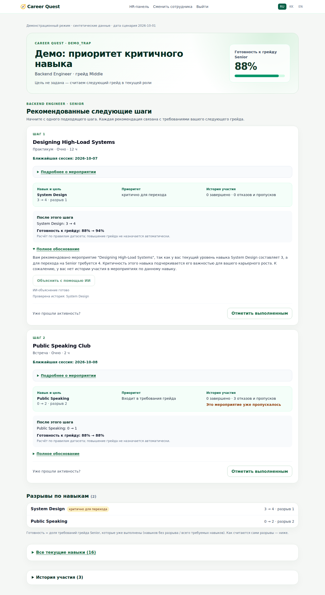

# Career Quest — понятный следующий шаг в карьере

**Не ещё один каталог курсов: сотрудник видит, почему нужен именно этот шаг и что изменится после него.**

HackAlem AI · Halyk Bank · кейс 1. Веб-приложение связывает навыки и историю участия
с требованиями целевого грейда, предлагает до трёх добровольных активностей и
пересчитывает прогресс после выполнения. HR видит дефициты компетенций и пробелы
в доступных программах развития.

**Работает без API-ключа.** С ключом появляется ИИ-объяснение с реальными вызовами
инструментов; решение и числовой прогноз остаются проверяемыми.

[Запуск](#запуск-за-одну-команду) · [Пример решения](#почему-не-просто-курс-по-самому-слабому-навыку) ·
[Проверка](#воспроизвести-результат) · [Критерии ТЗ](#соответствие-критериям) ·
[AI и архитектура](#как-работает-ai) · [Ограничения](#границы-прототипа)

| Проверено на данных репозитория | Результат |
|---|---|
| 200 сотрудников, 40 событий, 60 навыков | 439 рекомендованных шагов; все доступны и дают прирост нужного навыка |
| Выполнение первого шага у каждого из 179 сотрудников с рекомендациями | 179 из 179 прогнозов совпали с результатом; навыки не уменьшились |
| Автотесты в Docker без сети и API-ключа | 38 passed |
| Проверка интерфейса | RU / KK / EN, ширина 390 px, вход сотрудника и HR |

Это **проверки корректности на синтетических данных**, не доказательство роста
вовлечённости. [Машиночитаемый результат](docs/evaluation.json) генерируется
[открытым скриптом](scripts/evaluate.py), а не прописан в движке.
21 профиль без рекомендаций не считается автоматически успешным:
HR отдельно показывает отсутствие подходящего шага и неизвестные требования.

## Запуск за одну команду

Из корня клонированного репозитория, при установленном Docker с Compose:

```bash
docker compose up --build
```

Открыть **http://localhost:8000**. Для первой сборки нужен интернет, после сборки
основной сценарий не требует внешних сервисов. Python, Node.js и ключи на машине
проверяющего не нужны; CSS и синтетический датасет находятся в репозитории.

| Роль | Логин | Пароль | Доступ |
|---|---|---|---|
| Сотрудник | `E0028` | `employee-demo` | Только свой профиль и действия |
| HR / проверка решения | `hr` | `hr-demo` | Все профили, HR-сводка, загрузка JSON/CSV |

Это **публичные учебные учётные записи**, не защита реальных данных.
Проверка состояния: http://localhost:8000/health.
Развёрнутого публичного сервиса нет; воспроизводимый артефакт — этот репозиторий.

## Почему не просто курс по самому слабому навыку

**Один проверяемый пример вместо обещания «персонализации».**
Дополнительный профиль `DEMO_TRAP`: Backend Engineer, Middle → Senior.

| Фактор | Public Speaking | System Design |
|---|---|---|
| Уровень → требование Senior | 0 → 2 | 3 → 4 |
| Критичность для перехода | Нет | Да |
| История по навыку в этом примере | Три отказа/пропуска | Нет записей |
| Правило «самый низкий уровень» | Выбрало бы этот навык | Пропустило бы |
| Career Quest | Не первый приоритет | **Первый шаг — EV_006** |

Разрывы имеют одинаковый взвешенный балл: `2 × 1 = 1 × 2`.
При равенстве приоритет получает критичный навык. История затем влияет на выбор
конкретной активности и явно присутствует в объяснении — **не выдаём её за
скрытый множитель ранжирования навыков**.

До выполнения: **88% готовности**. Прогноз первого шага: **System Design 3 → 4,
готовность 88% → 94%**. После отметки выполнения получаются именно эти значения.
Готовность — доля выполненных требований, а не вероятность повышения.

<details>
<summary><strong>Посмотреть реальную карточку и ИИ-объяснение</strong></summary>



</details>

### Проверить самостоятельно за 3 минуты

1. Войти как **HR** и на `/hr` загрузить одновременно
   [employees.json](docs/demo/employees.json) и [activity_history.csv](docs/demo/activity_history.csv).
2. Открыть http://localhost:8000/employee/DEMO_TRAP — проверить первый шаг,
   факторы, описание, сессию и прогноз **88% → 94%**.
3. Отметить первый шаг выполненным — увидеть фактическое изменение навыка и готовности.
4. Открыть `/employee/DEMO_HISTORY`: завершение после последней оценки уже учтено,
   готовность **100%**, лишних рекомендаций нет.
5. Открыть `/employee/DEMO_UNKNOWN`: **«недостаточно данных»**, а не ложные 100%;
   профиль выделен на HR-панели.

Это наши демонстрационные профили, **не неизвестные заранее профили жюри**.
Новые профили проходят тот же код: ветвлений по `DEMO_*` в приложении нет.
[Подробности сценария](docs/DEMO.md) · [Проверка через JSON API](docs/API.md)

## Воспроизвести результат

Команды выполняются из корня репозитория после сборки образа.
Они создают отдельное хранилище в процессе и не меняют данные работающего демо.

**Все тесты, без ключа:**

```bash
docker compose run --rm --no-deps -e OPENAI_API_KEY= \
  -v "$PWD:/submission:ro" -w /submission/backend \
  career-quest pytest tests -q -p no:cacheprovider
```

**Проверки всех 200 профилей и JSON-отчёт, без сторонних Python-пакетов:**

```bash
python3 scripts/evaluate.py
```

Если Python не установлен:

```bash
docker compose run --rm --no-deps -e OPENAI_API_KEY= \
  -v "$PWD:/submission:ro" career-quest python /submission/scripts/evaluate.py
```

Скрипт возвращает код `0` только при успешных проверках, иначе `1`.
JSON содержит результаты проверок, ожидаемый/фактический прогресс и SHA-256
входных файлов. [Сохранённый отчёт](docs/evaluation.json) можно сравнить с новым запуском.
Это дополняет, а не заменяет HTTP-тесты авторизации, импорта и обработки ошибок.

## Соответствие критериям

Баллы ниже — **веса из ТЗ, не самостоятельно выставленная оценка**.

| Критерий | Вес | Что проверять в репозитории |
|---|---:|---|
| Соответствие задаче и работоспособность | 25 | [Сквозной тест](backend/tests/test_demo.py): импорт → рекомендация → выполнение → HR; [профиль сотрудника](backend/app/templates/employee.html) |
| Техническая реализация | 25 | [Движок](backend/app/engine.py), [AI tools и дедлайн](backend/app/explain.py), [права и CSRF](backend/app/auth.py), [тесты AI](backend/tests/test_explain.py) |
| README и воспроизводимость | 25 | Один Docker-запуск, учебные учётные записи, [фикстуры](docs/demo/), [JSON-отчёт](docs/evaluation.json), [API-инструкция](docs/API.md) |
| Ценность и применимость | 15 | Видимый результат шага до выполнения, добровольность, [HR-срез](backend/app/templates/hr.html); план проверки эффекта ниже |
| Потенциал и оригинальность | 10 | Проверяемый прогноз + история после оценки + ИИ с инструментами и независимым от модели расчётом; развитие без смены схемы навыков |

[Подробная матрица обязательных требований и границы проверки](docs/REVIEW.md)

## Как работает AI

Используется **гибридный подход**, а не рекомендация по одному полю и не
непроверяемое решение языковой модели:

1. `store.py` загружает последнюю оценку и применяет завершения после
   `last_review_date` по порядку дат. Повторный импорт не начисляет прирост дважды.
2. `engine.py` определяет цель: `career_goal` или следующий грейд; считает
   `gap = required − current`, `score = gap × (2, если критичен, иначе 1)`.
   При равенстве баллов идут критичность, затем стабильный ID.
3. Из каталога исключаются обязательные, неподходящие по роли/грейду/предпосылкам,
   уже завершённые неповторяемые и не дающие прироста активности.
   Среди кандидатов предпочитаются ранее не отклонённые, затем больший реальный прирост.
4. До трёх выбранных шагов получают факторы и прогноз по тем же правилам
   `gain / max_level`, что используются при фактическом выполнении.
5. По кнопке модель через **function calling** запрашивает
   `get_skill_history` и при необходимости `get_alternative_events`,
   после чего формулирует объяснение. Интерфейс показывает реально вызванные инструменты.

**Граница ответственности модели:** объяснить, а не менять рейтинг, навыки или историю.
Вызов истории обязателен для каждого навыка шага; без него AI-текст не принимается.
Это проверяет использование инструментов, **не гарантирует истинность каждой фразы**:
числовые факторы остаются видимыми отдельно.

Сетевой цикл имеет общий дедлайн **8 секунд**, без повторов SDK; при ошибке остаётся
шаблонное объяснение. Страница вообще не ждёт API. Успешные ответы кэшируются на
5 минут по фактам и языку; лимит — 12 новых запросов в минуту, 4 одновременно на процесс.

Для реального AI скопировать `.env.example` в `.env`, указать `OPENAI_API_KEY`
и выполнить `docker compose up -d --force-recreate`.
Модель по умолчанию — `gpt-4o-mini`; переменная `OPENAI_MODEL` позволяет заменить её.
Не публикуйте ключ. Имя сотрудника модели не передаётся; факты о навыках и участии
передаются провайдеру при запросе объяснения.

**Без ключа:** рекомендации, три фактора, прогноз, выполнение, HR и импорт работают;
генеративное объяснение заменяется локальным шаблоном. Это не имитация ответа модели:
в API явно различаются `source: template` и `source: llm-agentic`.

## Ценность и следующий этап

| Проблема | Механизм в прототипе | Как проверить пользу на пилоте |
|---|---|---|
| «Не понимаю, зачем мне курс» | Связь с целевым грейдом и прогноз изменения навыка | Доля добровольно начатых и завершённых рекомендаций |
| Повторные приглашения на нежелательные активности | История отказов при выборе события, видимое объяснение | Повторные пропуски относительно текущей рассылки |
| HR не видит пробелы в программе развития | Разрывы навыков и сотрудники без доступного шага | Доля сотрудников с разрывами, для которых есть подходящая активность |

**Эффект на реальных сотрудниках не измерен.** Для пилота: сравнить текущую рассылку
и рекомендации на сопоставимых группах, учитывать исходные грейды/разрывы, измерять
добровольное участие и закрытие критичных требований; не превращать эти метрики
в публичный рейтинг сотрудников.

Отличие прототипа — не заявление о новой категории HR-продуктов, а связка
**«объяснимый выбор → проверяемый прогноз → подтверждённое изменение»**.
Следующие этапы: постоянная БД и корпоративный вход; обратная связь «подходит / не подходит»;
интеграция с LMS и календарём для подтверждения участия. Это **план**, не готовые функции.
Ядро использует справочники роли/грейда/навыков; расширение на другую организацию
потребует её матрицы компетенций и проверки правил доступности.

## Архитектура и данные

Python 3.13 · FastAPI · Jinja2 · локальный Tailwind CSS · OpenAI SDK · pytest.
Серверный HTML не требует сборки фронтенда при запуске.


| Компонент | Ответственность |
|---|---|
| [store.py](backend/app/store.py) | Данные, история, применение прироста и атомарный импорт |
| [engine.py](backend/app/engine.py) | Ранжирование, доступность, прогноз и HR-агрегаты |
| [explain.py](backend/app/explain.py) | Локальные объяснения и асинхронный AI-цикл |
| [auth.py](backend/app/auth.py) / [main.py](backend/app/main.py) | Сессии, права, CSRF, HTML/JSON API |
| [templates](backend/app/templates/) / [static](backend/app/static/) | Интерфейс RU/KK/EN, мобильная версия, запрос AI по кнопке |
| [tests](backend/tests/) | Регрессии, маршруты, права, импорт, таймауты и сценарии |
| [seed](backend/app/data/seed/) | Синтетический стартовый датасет и его правила |

Дата сценария — **2026-10-01**, из датасета, не из часов компьютера.
Импорт поддерживает JSON-профили и CSV-историю, UTF-8 с BOM, до 5 МБ на файл.
Если `last_review_date` не задана, уровни считаются текущими: исторические завершения
не начисляются повторно. Неизвестная роль/цель даёт неопределённую готовность,
а не ложные 100%. Lead без явной цели сравнивается с требованиями текущего грейда.

## Границы прототипа

- **Данные в памяти одного процесса.** Перезапуск сбрасывает импорт и отметки выполнения.
- **Демодоступ публичен.** Есть серверные проверки ролей/владельца и CSRF, но нет SSO,
  MFA, аудита и защиты уровня production. Для пилота отключить `DEMO_MODE`, настроить
  учётные данные, `SESSION_SECRET` и HTTPS. [Параметры](.env.example).
- **AI-текст может ошибаться.** Тесты не являются оценкой лингвистического качества;
  вычисленные факторы служат отдельным источником проверки.
- **Готовность — не аттестация.** Выполнение в демо подтверждается самим пользователем,
  а рост навыка следует условному правилу датасета, не результату экзамена.
- **Сигнал вовлечённости — эвристика**, а не обученная модель вероятности увольнения.
- Награды, внутренняя валюта и геймификация не реализованы: по ТЗ они опциональны.
  Обязательные активности не входят в добровольный рекомендательный контур.
- Локальные замеры скорости не доказывают SLA под нагрузкой; промышленный масштаб не проверен.

## Интерфейс и дополнительные материалы

| Сотрудник | HR |
|---|---|
|  |  |

[Казахский интерфейс](docs/screenshots/employee-kk.png) ·
[Английский интерфейс](docs/screenshots/employee-en.png) ·
[Экран входа](docs/screenshots/index-ru.png) ·
[Сценарий проверки](docs/DEMO.md) · [API](docs/API.md) · [Сверка с ТЗ](docs/REVIEW.md)

Разработка без Docker: `cd backend`, создать окружение Python 3.13, установить
`pip install -r requirements.txt`, запустить `uvicorn app.main:app --reload`.
Локальные проверки: `pytest tests -q`, `ruff check app tests` (Ruff установить отдельно).
Пересборка CSS нужна только при изменении классов:
`cd backend && npx --yes --package tailwindcss@3.4.17 tailwindcss --input styles/tailwind.css --output app/static/tailwind.css --content './app/templates/*.html' --minify`.
