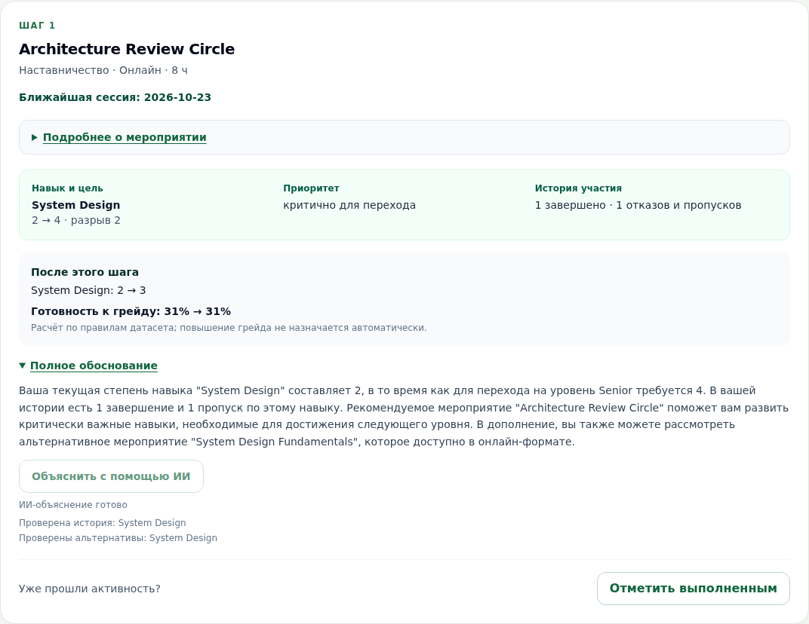
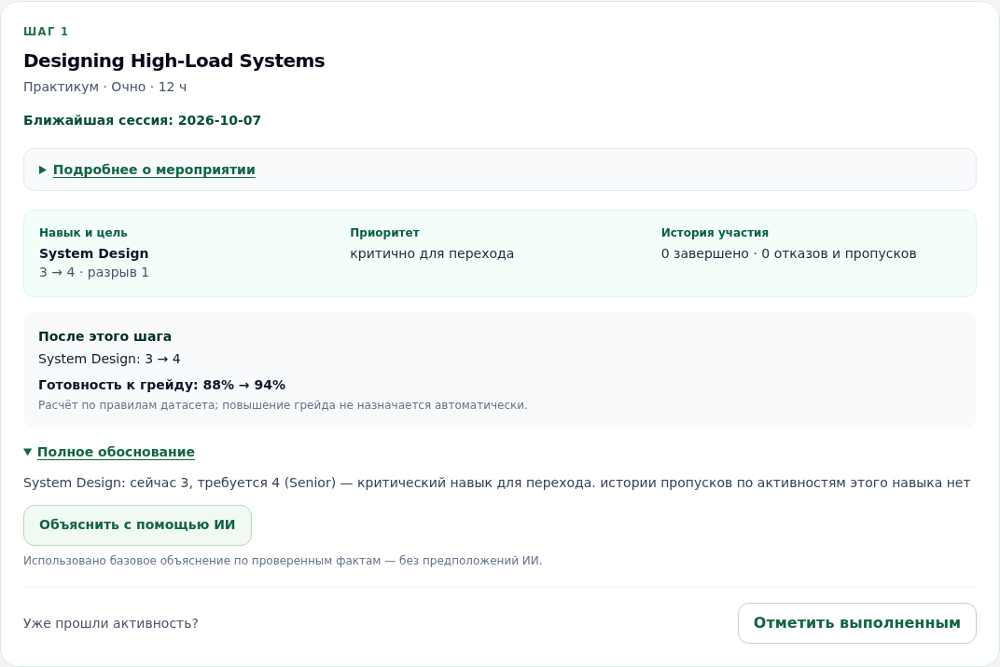

# Примеры объяснений: ИИ и безопасный базовый режим

Это снимки **работающего приложения**, не макеты и не тексты, написанные вручную.
Зафиксированы 23 сентября 2026 года; дата синтетического сценария — 1 октября 2026.
[Ответы API приложения в JSON](ai-examples.json) содержат текст, источник,
вычисленные факты и названия выполненных инструментов. Это не сырой лог провайдера
и не независимая оценка качества модели. Ключи и cookie в артефакт не входят.

## 1. Есть история: ИИ проверяет альтернативы

**E0005, EV_007, русский язык.** Исходные факты: System Design 2 при требовании 4
для Senior; навык критичен; по истории одно завершение и один пропуск.

В зафиксированном ответе модель:

- верно указала текущий и требуемый уровни, критичность и обе записи истории;
- вызвала `get_skill_history` и `get_alternative_events`;
- назвала доступную альтернативу System Design Fundamentals в онлайн-формате.

Источник — `llm-agentic`, время этого локального запроса — **4,537 с**.
Это единичный замер, не гарантия времени каждого ответа и не доказательство
безошибочности модели. Конкретная формулировка при повторном запросе может отличаться.



**Повторить:** войти как HR → `/employee/E0005?lang=ru` → карточка
Architecture Review Circle → «Полное обоснование» → «Объяснить с помощью ИИ».
Нужен настроенный ключ; без него останется базовый режим. Для API после входа
из [инструкции](API.md):

```bash
curl -fsS -b "$COOKIE_FILE" -H "X-CSRF-Token: $CSRF_TOKEN" -X POST \
  'http://localhost:8000/api/employees/E0005/explain/EV_007?lang=ru' | python3 -m json.tool
```

Профиль должен быть в начальном состоянии: если активность уже завершили,
рекомендация может измениться. Перезапуск демо восстанавливает исходный датасет.

## 2. Истории нет: не подменяем пробелы предположениями

**DEMO_TRAP, EV_006.** System Design 3 при требовании 4; критичность известна,
но записей участия по этому навыку нет. Рекомендация и прогноз 88% → 94% доступны.

В контрольном прогоне до исправления модель неправомерно связала отсутствие
записей с отсутствием практики. Поэтому, если хотя бы по одному навыку шага
вся история нулевая, приложение **не вызывает модель** и оставляет объяснение
по фактам. Отсутствие данных не говорит о способностях или мотивации человека.

В JSON это явно видно: `source: template`,
`fallback_reason: insufficient_history`, `tool_calls: []`.
Такой ответ не выдаётся за генеративный ИИ. Политика покрыта регрессионным тестом.



**Повторить:** загрузить [демонстрационные файлы](demo/) через HR-панель и открыть
`/employee/DEMO_TRAP?lang=ru`. С ключом запрос объяснения вернёт указанный безопасный
режим; без ключа базовое объяснение работает изначально.

## Что скриншот доказывает и чего не доказывает

Скриншот показывает внешний вид конкретного результата. JSON позволяет прочитать
тот же пример без распознавания изображения, а API и тесты позволяют проверить
механизм. Ни один удачный скриншот не заменяет проверку на других профилях,
сравнение с базовым алгоритмом или оценку фактической точности свободного текста.
